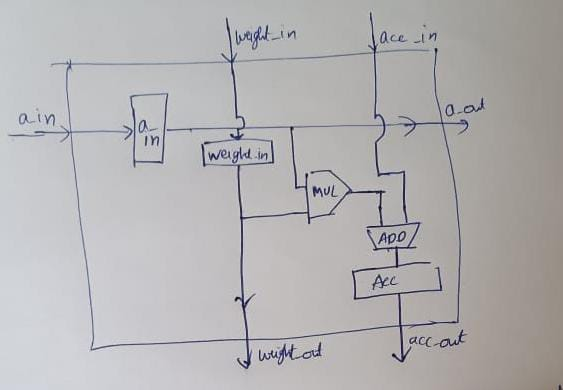
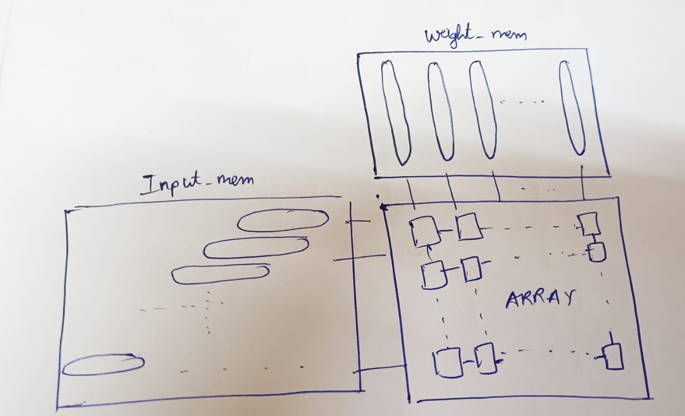
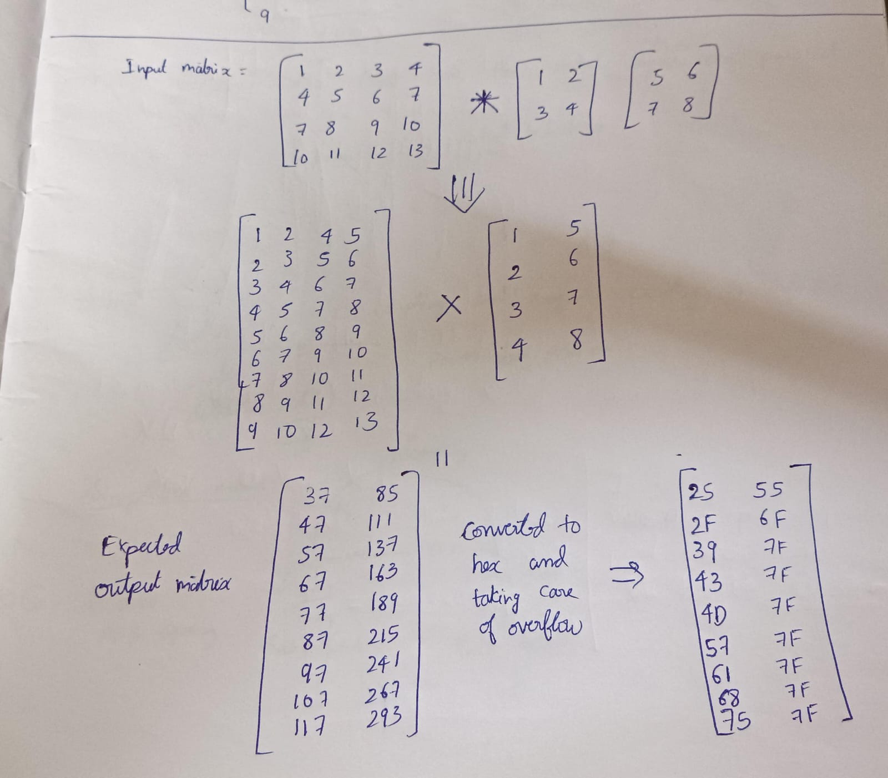

# Weight-Stationary Model for Systolic Array Processing Element

**Authors:**
- Mithin Kumar Pentapalli (22b1252@iitb.ac.in)
- Preetam Bhanoth (22b1254@iitb.ac.in)

## Overview

We have chosen a **weight-stationary model** for our systolic array design. The processing element (PE) is designed as shown below.

The overall array structure is:

## Functionality of the Array

The systolic array operates by processing two data streams: weights and inputs. The design incorporates enable signals for weights, input (a), and accumulated value registers.

### Data Flow Process
1. **Filling the Array with Weights**: Initially, weights are loaded into the array, controlled by the `weight_en` signal.
2. **Switch to Input Stream**: After loading the weights, the array starts receiving input data, controlled by the `a_en` signal.
3. **Input Handling**: Inputs flow horizontally, while weights and accumulated values are handled vertically in the array.

### Interaction with CPU
The design uses separate local RAM to store inputs, weights, and outputs. These data are transferred between the array and the CPU using a communication protocol like **Wishbone**, allowing efficient data flow management.

### Motivation for Choosing Weight-Stationary Model
The weight-stationary model is optimal for AI applications, particularly **Deep Neural Networks (DNNs)**. In DNNs, weights are fixed while the input data varies. This model reduces memory access latency by ensuring that weights are not repeatedly fetched from memory, thus speeding up inference.

### Applicability to Various Applications
This array is adaptable for both **DNNs** and **convolution operations**. It processes matrix multiplications in DNNs and convolution operations with kernel filters in convolution tasks.

## Description

The systolic array is scalable with adjustable dimensions (height and width) via code parameters. It uses a **Kogge-Stone adder** for fast addition and a **Wallace tree multiplier** for efficient multiplication. The flow of `a` is **horizontal**, while `weight` and `acc` are **vertical**.

### Key Features:
- **Scalable**: Height and width can be adjusted.
- **Efficient**: Employs Kogge-Stone adder and Wallace tree multiplier.
- **Optimized Parallelism**: Designed for high-performance computation.

## Implementation Notes
- The systolic array maximizes parallelism for efficient computation.
- The **Kogge-Stone adder** improves performance by reducing latency compared to traditional adders.

## Video Submission
In the following video, the final SystemVerilog code is dumped onto the **VSDSquadron Mini FPGA** and the output is displayed via UART. The UART shows the matrix multiplication results at regular intervals. For demonstration, only one row of the output matrix is read.

[Watch the Video Submission](https://drive.google.com/drive/folders/171VYndACv2W_u6io5pRV3rhXbbNptUDK?usp=sharing)

## Accelerator vs CPU Comparison

### CPU-only Simulation
For the CPU-only simulation, we used the **Ripes simulator** with a 5-stage pipelined **RISC-V 32IM processor**. The C code was compiled into **RISC-V** assembly using **Compiler Explorer** and simulated on [Ripes](https://ripes.me/).

- The C code implements complete convolution.
- After simulation, the CPU took **7534 cycles** to execute.

### CPU + FPGA
For this setup, only preprocessing is done in C code:
- **Preprocessing**: Took **3003 cycles**.
- **Systolic Array**: Took **24 cycles** for matrix multiplication.
- **Total for Matrix Operation**: **3003 + 24 = 3027 cycles**.

Additionally, the data transfer back from the systolic array (modeled as memory loading) required **228 cycles**, bringing the total to **3231 cycles**.

### Conclusion
We observed a significant performance improvement with the systolic array, reducing the cycles from **7534 (CPU-only)** to **3231 (CPU + FPGA)**. This demonstrates a nearly **two-fold increase in performance** with the systolic array.

